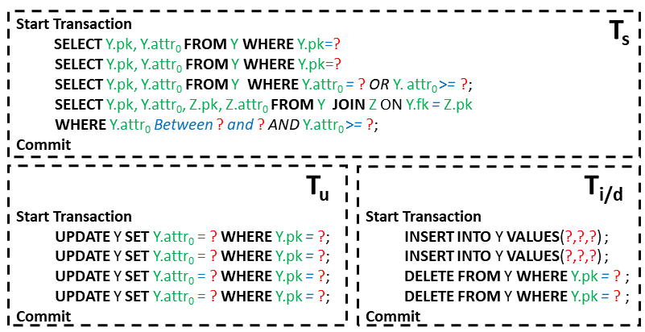

**Workload YCSB-SQL Referenced from YCSB and Extends it.**

**1.Schema**

- Y(pk int, attr0 varchar(140), fk0 int, foreign key(fk0) reference to Z(pk))

- Z(pk int, attr0 int, attr1_col0 int, attr1_col1 varchar(140))

**2.Transaction Template**

Including the following three types of transactions:

- T_s evenly contains two item-reads on table Y and two predicate-read on table Y and Z;
- T_u contains four updates on table Y;
- T_i/d contains two inserts and two deletes on table Y.
- The default ratio of the four transactions is set to: 40:40:20

**3.Database Population**

- By default, randomly initialize 2,000 records into Y and 20 records into Z.
- Considering  \Delta-tolerant stable attribute, the values in attr_0 of table Y are sampled from a Uniform distribution on a domain \{China, Japan, Russia, Britain\}. 
- Considering partition-based primary key, there is 20\% dynamic keys in table Y.

**4.Transaction Instantiation**

- update and item-read choose parameters from the static keys and existed dynamic keys in Y.
- insert chooses parameters from the non-existed dynamic keys in Y. 
- delete chooses parameters from the existed dynamic keys in Y.
- predicate-read chooses parameters as \Delta-tolerant stable attribute.
- the locking timeout in miniature\ shadow sets 200ms.

**5.Transaction Loader**

- YCSB-SQL issues 24 threads to load 4.8K transactions under Serializable. 